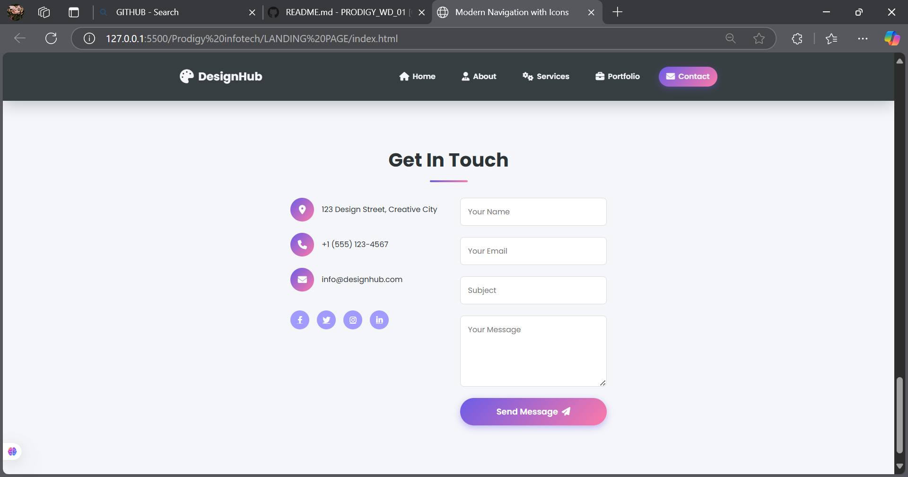

##Interactive Navigation Menu

This is a simple web development project that demonstrates how to create an interactive, fixed-position navigation menu using HTML, CSS, and JavaScript. The menu changes its style dynamically when the page is scrolled or when a user hovers over a menu item.

Features

Fixed navigation bar visible on all pages

Smooth color/style transition on scroll

Hover effects for better user interaction

Built using HTML for structure, CSS for styling, and JavaScript for interactivity

Demo

How It Works

HTML defines the structure of the navigation bar and menu items.

CSS is used to style the navbar, handle hover effects, and create transition effects.

JavaScript detects when the user scrolls and changes the menu style dynamically.

Installation

1. Clone the repository:

git clone https://github.com/Namira2/prodigy-wd-01.git

2. Open index.html in your browser.

Technologies Used

HTML5

CSS3

JavaScript (Vanilla)

Author

Namira
